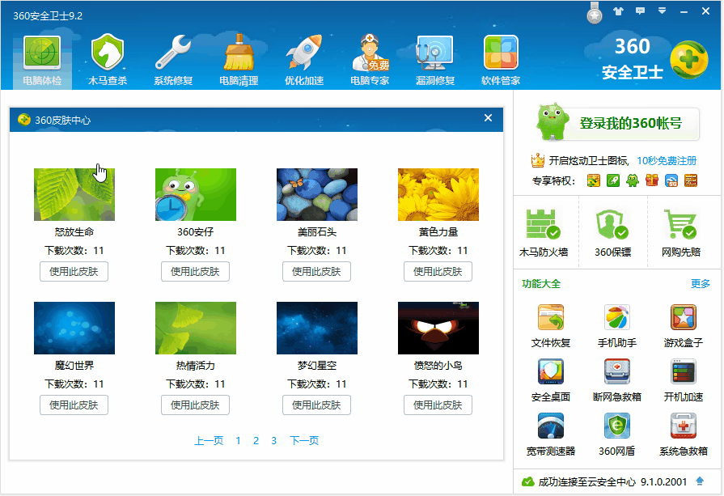
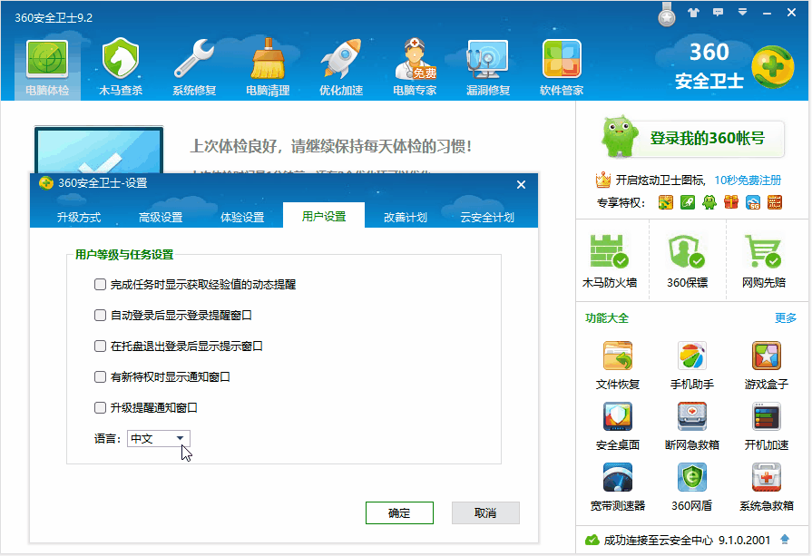
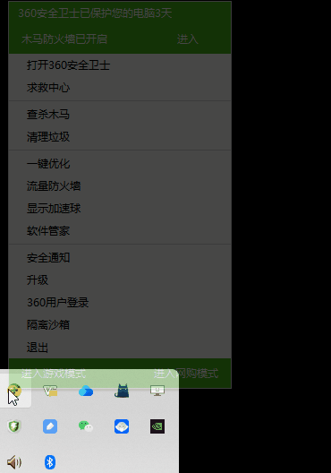

Qt 百宝箱，各种资源应有尽有！

开发环境：Qt6 + CMake

# 360 

该代码为 10 年前学习 Qt 所写（原地址：[Qt 实现 360 安全卫士](https://bbs.csdn.net/topics/390614347)），主要模拟实现了部分 360 界面。

分享仅供大家学习使用，不可用作任何商业目的，否则后果自行承担！

主界面切换：

更换皮肤：

用户登录：

国际化：

新版特性：

系统托盘：

# 关于作者

作者：[一去、二三里](https://waleon.blog.csdn.net/)，爱编程、爱学习、爱生活！

- [个人博客](https://waleon.blog.csdn.net/)
- 个人微信：iwaleon（加我微信，邀请入 500 人微信群）
- 个人 QQ：550755606
- QQ 技术交流群：242790253

更多精彩，欢迎大家关注我的微信公众号：高效程序员

聚焦程序人生，践行终身成长。专注分享 IT 技术、学习资料、职场经验、热点资讯，有趣、好玩、靠谱！
